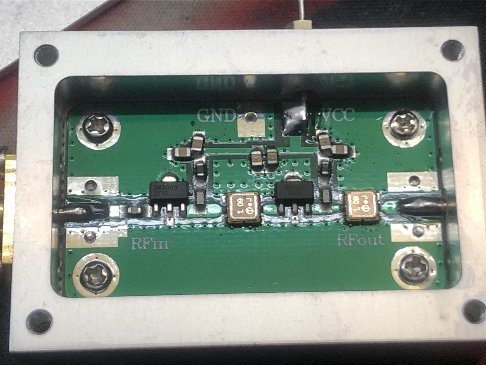
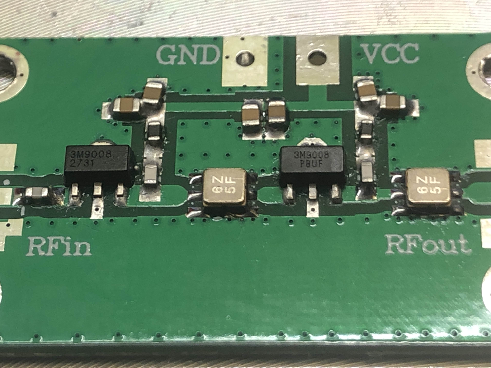
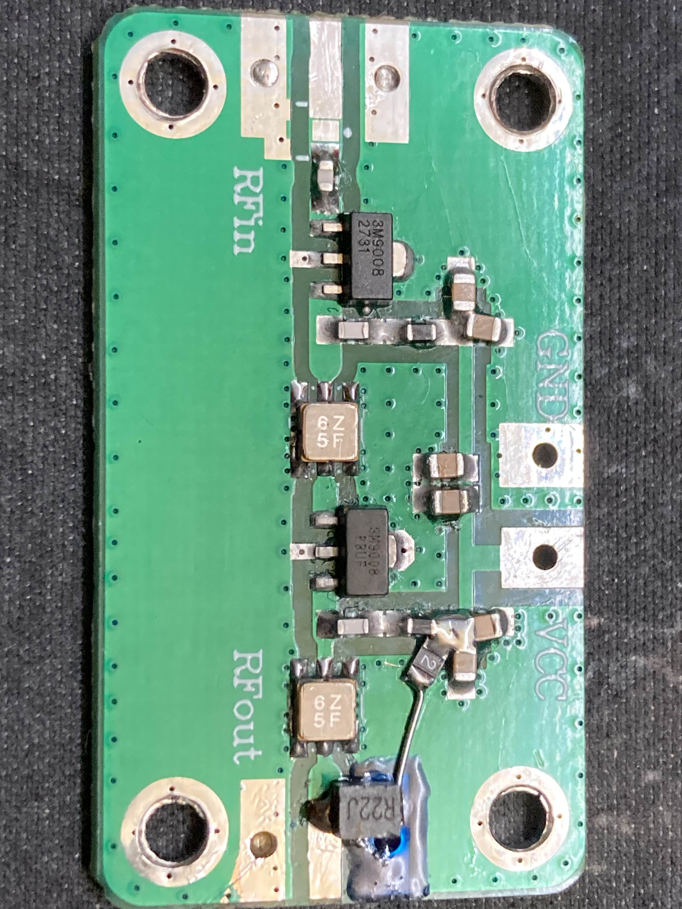
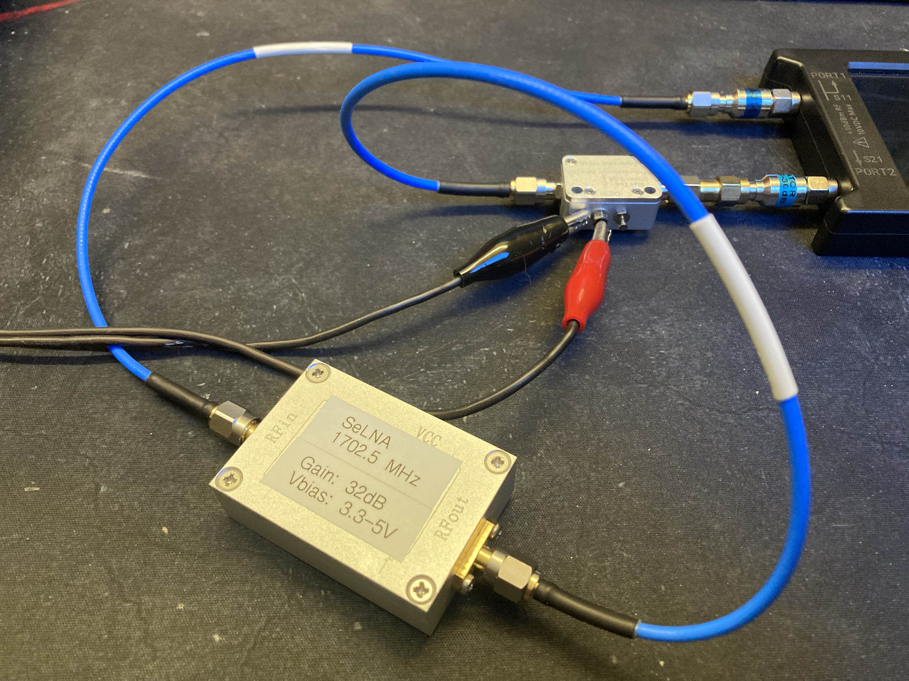
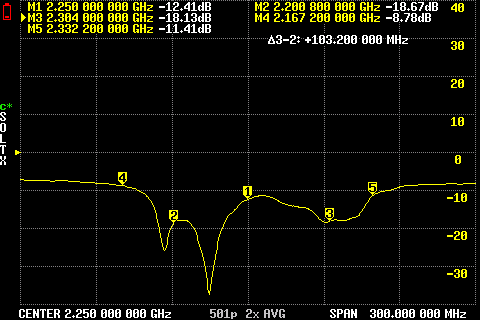
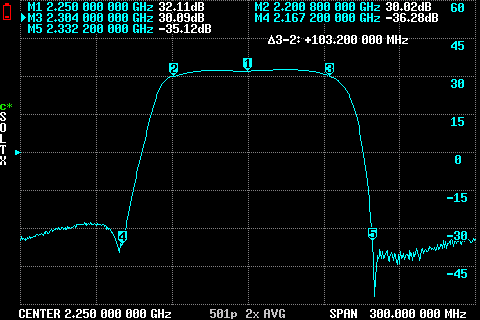
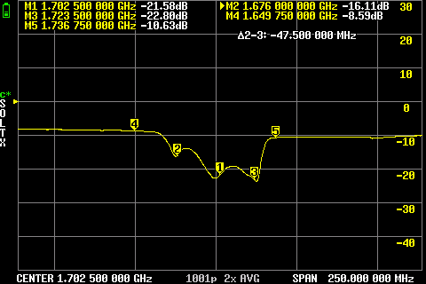
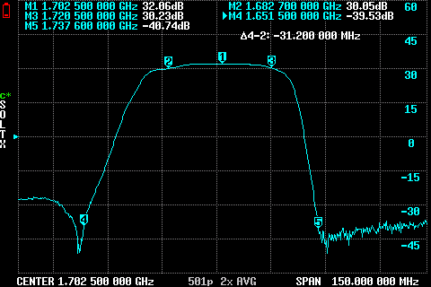
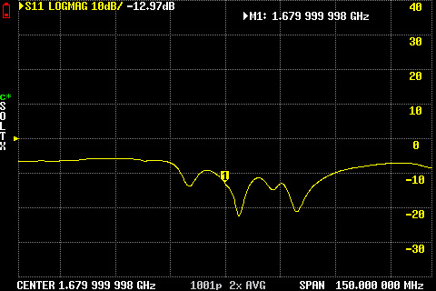
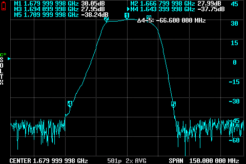

# SeLNA
Affordable and relatively easy to make filtered LNA.

## Getting a base to modify
It's much easier to modify and repurpose existing LNA pcb than to make your own.
We are going to focus on double-filtered chinese ADS-B LNAs, as they are reasonably priced and easy enough to modify. As a bonus you can get a version with robust, aluminium enclosure, that contains the same PCB.
Search on Ali by "ADS-B LNA" and you are likely to find it on first page.

## Other components
You'll also need SAW filters of your choice (i'm using TA0700A for S-Band); 180-220nH (fine for L and S-band) 1210 SMT inductor and a poly fuse (200mA) - if you want to also power the LNA with bias tee. Obviously soldering supplies like decent flux and solder of your choice. I recommend using some UV soldermask for the bias-t modification and conformal coating the board after the mods.

## Disassembly & prep
Remove all the screws you can see (4x countersunk M2.5 to remove the lid, 4x M2.5 for the SMAs, 4x M2 to remove the board).

Next part will be tricky, you need to both melt the solder and unscrew the VCC pass-trough at once. After that you can remove the SMAs (by melting the solder and carefully pulling them out). The PCB should now be free, you can clean it up with some isopropyl alcohol and move on to the next step.

## Replacing the filters
With the board removed and clean, it's time to preheat it to 80-90°C. Once it's warm, you can add flux near the SAWs and start heating up the area around them with hot air (i set mine to 320°C). Remove the old filters carefully, and use solder wick with soldering iron to remove old lead-free solder from the pads. Quick cleanup with isopropyl alcohol and q-tips, then you can start soldering the new filters. You'll notice, that the new SAWs have different (smaller) footprint than old ones. As long as you center them well enough on the pads it should still work fine. I usually solder them by hand - starting with wetting the larger ground pad with some solder, placing the filter on it while the solder is molten and then finishing other pads all around.

## Adding a bias tee (optional)
You can skip this part if you wish to power the LNA with external power supply.
There's no good way of performing this modification - it'll be sketchy no matter how you do it. Start with wicking the solder off the SMA ground pad on the output side, then clean up the surrounding area with isopropyl alcohol. I recommend covering the pad with UV soldermask, but kapton tape will work too. Solder the bias inductor to the pad, making sure to leave yourself space for the SMA pin. Then add a poly fuse to the VCC pad, and connect it to your bias inductor.

## Finishing touches
Now it's time to put some conformal coating on the backside of PCB, then you can put it inside the enclosure, mount and solder the SMAs. If you chose not to add a bias tee, you also need to screw the VCC pass-trough back in and solder it. Before you put any coating on the PCB...

## Verifying your work
Start with basic continuity tests, and making sure there are no obvious shorts on RF or VCC paths. Then you can move on to powering your LNA for the first time, and sweeping it to see how it performs (make sure PCB screws are in, and lid is closed).
I'm using LiteVNA64, with dc block on port 1 and 30dB attenuator + bias tee on port 2.

This isn't a VNA guide, but make sure to calibrate with the final setup (excluding the LNA of course).

Here are some example results from a few LNAs i made.

S-band with TA0700a filters:

L-band with TA2727AA3112 filters:

L-band with TA1583A filters - version without the enclosure:

After verifying your LNA performance, you can put a layer of conformal coating on the front of PCB. I also recommend plugging the now empty threaded hole for the VCC pass-trough with a M2.5 screw.
